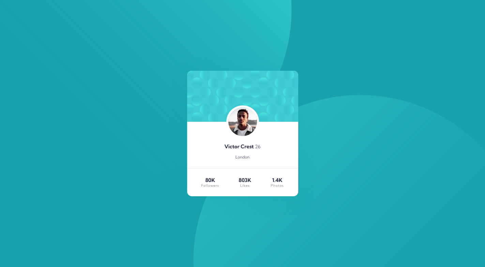

# Frontend Mentor - Profile card component solution

This is a solution to the [Profile card component challenge on Frontend Mentor](https://www.frontendmentor.io/challenges/profile-card-component-cfArpWshJ). Frontend Mentor challenges help you improve your coding skills by building realistic projects. 

## Table of contents

- [Frontend Mentor - Profile card component solution](#frontend-mentor---profile-card-component-solution)
  - [Table of contents](#table-of-contents)
  - [Overview](#overview)
    - [The challenge](#the-challenge)
    - [Screenshot](#screenshot)
    - [Links](#links)
  - [My process](#my-process)
    - [Built with](#built-with)
    - [What I learned](#what-i-learned)
    - [Continued development](#continued-development)
  - [Author](#author)


## Overview

### The challenge

- Build out the project to the designs provided

### Screenshot




### Links

- Solution URL: [Click to see the project solution](https://github.com/Agbortoko/fem-profile-card-component)
- Live Site URL: [Click to see the live project](https://agbortoko.github.io/fem-profile-card-component/)

## My process

### Built with

- Semantic HTML5 markup
- CSS custom properties
- Flexbox
- Mobile-first workflow
- [SASS](https://sass-lang.com/) - CSS with superpowers


### What I learned

I learnt how to carry out positioning of items on my webpage using the position css property


``` sass
.pattern{

    img{
        max-width: 100%;
    }

    &--top{
        position: absolute;
        z-index: -1;
        pointer-events: none;
        top: rem(-462);
        left: rem(-748);

        @include breakpoint-up(medium){
            top: rem(-462);
            left: rem(-505);
        }

        @include breakpoint-up(large){
            top: rem(-462);
            left: rem(-122);
        }
    }

    &--bottom {
        position: absolute;
        z-index: -1;
        pointer-events: none;
        bottom: 0;
        right: 0;
        bottom: rem(-462);
        right: rem(-748);

        @include breakpoint-up(medium){
            bottom: rem(-462);
            right: rem(-505);
        }

        @include breakpoint-up(large){            
            bottom: rem(-462);
            right: rem(-122);
        }

    }

}
```


### Continued development

- Try understanding more about layout in css
- Keep practicing how to use sass
- Build my own css framework
- Practice JS and Learn JS framework


## Author

- Website - [RabbitMaid Website](https://www.rabbitmaid.com)
- Frontend Mentor - [@Agbortoko](https://www.frontendmentor.io/profile/Agbortoko)
- Twitter - [@agbortoko_arrey](https://www.twitter.com/agbortoko_arre=y)


